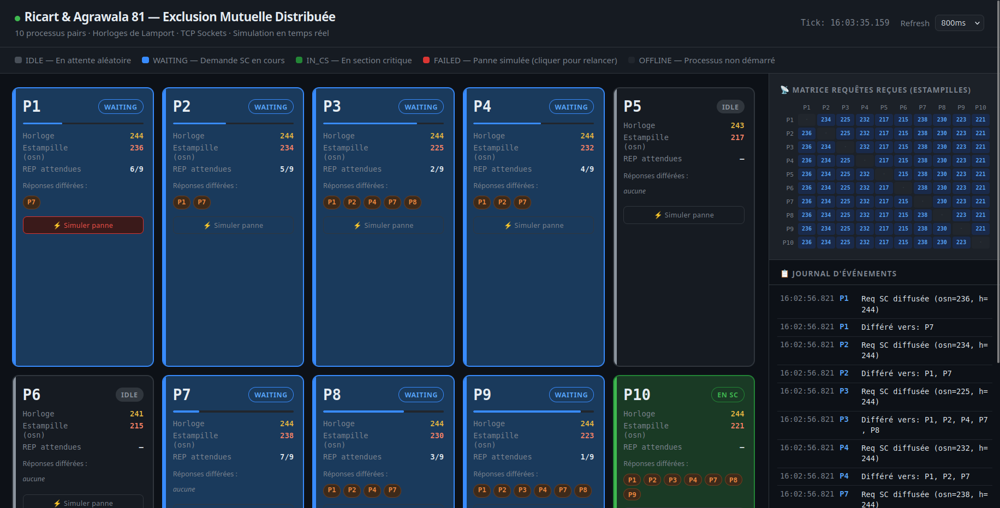

# RA81 — Simulation d'Exclusion Mutuelle Distribuée (Ricart & Agrawala 1981)

**SYSR – 2CS · ESI · Par D.E. MENACER**

## Architecture

```
┌─────────────────────────────────────────────────────────────┐
│                  ra81_process (×10 instances)               │
│  ┌────────────────┐    ┌──────────────────────────────────┐ │
│  │ Listener Thread │    │         Main Loop Thread          │ │
│  │ (TCP server)    │    │  idle(1-5s) → REQ → wait REPs    │ │
│  │ accept() loop   │◄──►│  → CS(1-2s) → release            │ │
│  │ handle_message()│    └──────────────────────────────────┘ │
│  └────────────────┘                                          │
│       │  ↕ TCP (port 9001..9010)                             │
│  ┌────────────────────────────────────────────────────────┐  │
│  │    /tmp/ra81_proc_<id>.json   (état partagé GUI)       │  │
│  └────────────────────────────────────────────────────────┘  │
└─────────────────────────────────────────────────────────────┘
            ↕ HTTP GET /state   ↕ POST /fail/<id>
┌─────────────────────────────────────────────────────────────┐
│              ra81_server.py (port 8080)                      │
│        Agrège les JSON → API REST → Dashboard HTML           │
└─────────────────────────────────────────────────────────────┘
```

## Structure du projet

```
ra81_sim/
├── include/
│   └── ra81_common.h       # Types partagés, constantes, ports
├── src/
│   └── ra81_process.cpp    # Implémentation complète RA81
├── gui/
│   └── dashboard.html      # Interface graphique temps-réel
├── ra81_server.py          # Serveur HTTP pour le dashboard
└── Makefile
```

## Compilation

```bash
make
```
Nécessite : `g++ ≥ 7`, C++17, POSIX (Linux/macOS).

## Démarrage complet

### Option 1 — Makefile (tout en une commande)
```bash
make start          # Lance les 10 processus en arrière-plan
python3 ra81_server.py 8080  # Lance le serveur de dashboard
# Ouvrir http://localhost:8080
```

### Option 2 — Manuel
```bash
# Terminal 1..10 (ou en arrière-plan) :
./ra81_process 1 &
./ra81_process 2 &
...
./ra81_process 10 &

# Terminal dashboard :
python3 ra81_server.py 8080
```

### Arrêt
```bash
make stop
```

## Encodage des ports TCP

Chaque processus `i` (1..10) écoute sur le port **9000 + i** :
- P1 → 9001, P2 → 9002, ..., P10 → 9010
- Défini dans `include/ra81_common.h` : `process_port(id) = BASE_PORT + id`

## Algorithme RA81 implémenté

### Variables locales par processus Pᵢ
- `g_clock` : horloge de Lamport
- `g_osn`   : estampille de la requête courante
- `g_replies_needed` : nombre de REP encore attendues (initialisé à N-1)
- `g_sc_wanted` : Pᵢ désire entrer en SC
- `g_deferred[j]` : réponse différée vers Pⱼ

### Protocole (3 étapes)

**1. Demande d'entrée en SC :**
```
clock++ ; osn = clock ; sc_wanted = true ; replies_needed = N-1
Diffuser (REQ, osn, i) à tous les autres
Attendre (replies_needed == 0)
```

**2. Réception d'un REQ de Pⱼ :**
```
Si sc_wanted ET (osn < ts_j OU (osn == ts_j ET i < j)) :
    Différer la réponse  →  deferred[j] = true
Sinon :
    Envoyer (REP) à j immédiatement
```

**3. Sortie de SC :**
```
sc_wanted = false
Pour tout j où deferred[j] : envoyer (REP) à j
```

### Complexité
- **2(N-1) messages** par entrée en SC : (N-1) REQ + (N-1) REP

### Conditions de Dijkstra satisfaites
- ✅ **Exclusion mutuelle** : un seul processus en SC à la fois
- ✅ **Attente finie** : ordre total sur les estampilles évite la famine
- ✅ **Non-blocage** : pas d'interblocage possible
- ✅ **Équité** : priorité basée sur l'estampille + ID (bris d'égalité)

## Simulation de pannes

### Injection de panne (SIGUSR1)
```bash
make fail ID=3      # Toggle PANNE sur P3
# ou directement :
kill -SIGUSR1 <PID_de_P3>
```

Depuis le dashboard : cliquer sur **"⚡ Simuler panne"** sur la carte du processus.

### Comportement en cas de panne
Un processus en panne (`FAILED`) :
- N'écoute plus les REQ entrants
- N'émet plus de REQ
- Annule son attente de REP si en cours
- Les autres processus deviennent bloqués si le processus en panne
  devait leur envoyer un REP (limite de RA81 de base, sans tolérance
  aux pannes complète — cf. extension avec messages ABSENT/RENTRÉE).

Envoyer à nouveau SIGUSR1 → **redémarrage** (état IDLE).

## Interface graphique — Dashboard

Accessible sur `http://localhost:8080`


| Zone | Contenu |
|------|---------|
| **Cartes processus** | État, horloge Lamport, estampille osn, REP attendues (barre de progression), réponses différées, bouton panne |
| **Matrice REQ** | Pour chaque paire (récepteur, émetteur) : dernière estampille de REQ reçue |
| **Journal** | Horodatage des transitions d'état (IDLE→WAITING→IN_CS→IDLE) et différés |
| **Barre de stats** | Compteurs globaux : en SC, en attente, pannes, max horloge, total accès SC |

Taux de rafraîchissement configurable : 400ms / 800ms / 1.5s / 3s.

## Logs texte

```bash
tail -f /tmp/ra81_1.log    # Log de P1
make watch ID=5            # Log de P5
```

## Références

- Ricart G., Agrawala A.K. (1981). *An optimal algorithm for mutual exclusion in computer networks.* CACM 24(1):9-17.
- Lamport L. (1978). *Time, clocks and the ordering of events in a distributed system.* CACM 21(7):558-565.
- D.E. MENACER, *SYSR – 2CS Chapitre 5 : Exclusion Mutuelle répartie*, ESI 2026.
